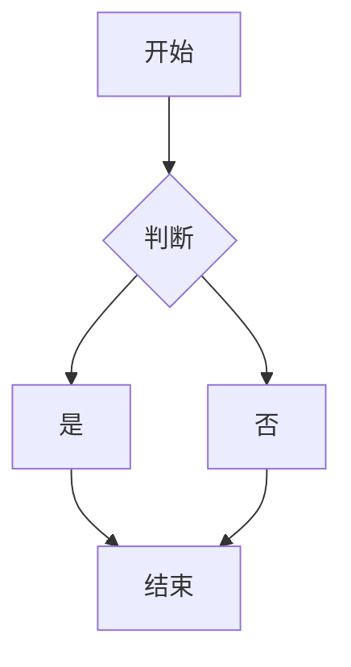
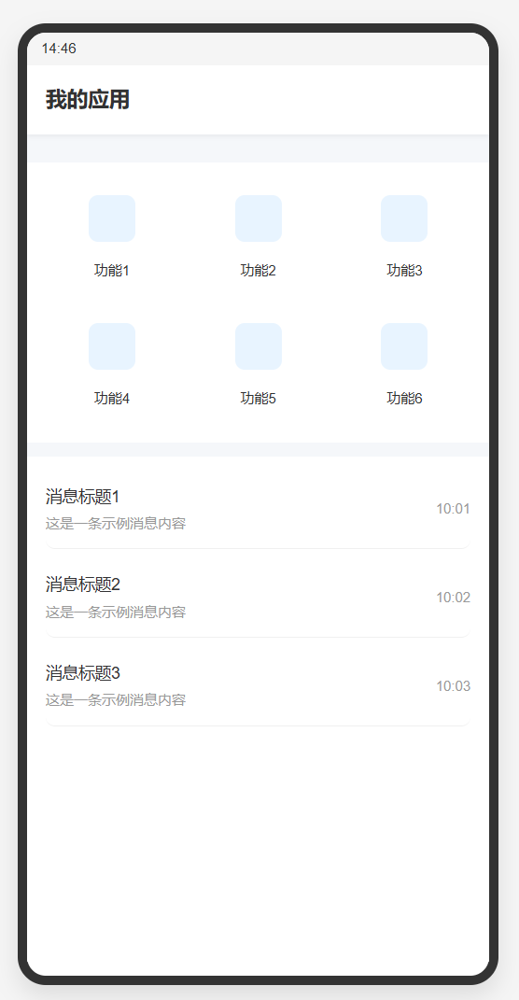

# 首页

## 文件存放
 - 编写readme.md保存在页面目录下即可，打包时会自动将文档打包到`dist`目录下;

## 流程图
 - 支持mermaid流程图, 示例如下:

## 图片
 - 图片存放与`src/views/{pagename}/`目录下，文档中使用相对路径引用图片;
 - 支持Markdown语法的图片引用及HTML标签形式的图片引用；
 - 示例如下：  
 
 html标签引用 
 
 markdown图片引用